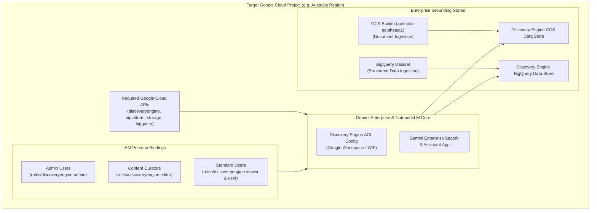

# Gemini Enterprise & NotebookLM Enterprise Terraform Deployment Blueprint

This repository provides a production-grade, standalone Infrastructure-as-Code (Terraform) blueprint to enable **Gemini Enterprise** and **NotebookLM Enterprise** on an existing Google Cloud project.

It automates API enablement, Access Control List (ACL) configuration for Identity Providers (Google Workspace or Workforce Identity Federation), enterprise document grounding data stores, and least-privilege persona IAM role mappings.

---

## 1. Architecture Overview



---

## 2. Prerequisites

### A. Google Cloud Permissions
The identity executing this Terraform configuration must have administrative permissions on the target Google Cloud project:
* `roles/resourcemanager.projectIamAdmin` (to assign Discovery Engine & Vertex AI roles)
* `roles/serviceusage.serviceUsageAdmin` (to enable required APIs)
* `roles/discoveryengine.admin` (to create data stores, ACL configs, and search engines)
* `roles/storage.admin` (if creating GCS grounding buckets)
* `roles/bigquery.admin` (if creating BigQuery datasets)

### B. Local Tooling
* **Terraform CLI**: version `>= 1.5.0`
* **Google Cloud SDK (`gcloud`)**: authenticated with ADC:
  ```bash
  gcloud auth application-default login
  ```

---

## 3. Directory Layout

```
.
├── .gitignore                   # Ignores local state files and sensitive tfvars
├── README.md                    # Deployment and verification documentation
├── CUSTOMER_VARIABLES_GUIDE.md  # Detailed variable guide & customer scenarios
├── providers.tf                 # Terraform, Google, Google-Beta, and Random provider definitions
├── variables.tf                 # Configurable input variables and type validations
├── main.tf                      # API enablement, ACL configuration, and Search Engine app
├── datastores.tf                # GCS and BigQuery grounding data store configurations
├── iam.tf                       # Least-privilege persona IAM role bindings
├── outputs.tf                   # Console URLs and resource identifiers
└── terraform.tfvars.example     # Example variable values for customer customization
```

---

## 4. Quickstart Deployment Guide

### Step 1: Create your `terraform.tfvars`
Copy the example file and update with your organization's values (see [CUSTOMER_VARIABLES_GUIDE.md](file:///Users/chrisslater/agy/enableNotebookLMEtf/CUSTOMER_VARIABLES_GUIDE.md) for full variable details):
```bash
cp terraform.tfvars.example terraform.tfvars
```

Edit `terraform.tfvars`:
```hcl
project_id                = "my-company-ai-project"
region                    = "australia-southeast1"
discovery_engine_location = "global"

idp_type = "GSUITE" # Or "THIRD_PARTY" for Workforce Identity Federation

admin_users = [
  "ai-admin@example.com"
]

standard_users = [
  "researcher1@example.com",
  "analyst@example.com"
]
```

### Step 2: Initialize Terraform
Initialize the working directory to download the Google and Random providers:
```bash
terraform init
```

### Step 3: Plan and Verify Changes
Generate and review the execution plan:
```bash
terraform plan
```

### Step 4: Apply Configuration
Provision the infrastructure:
```bash
terraform apply
```

---

## 5. Google Workspace Admin Console Configuration

If using **Google Workspace / Cloud Identity (`GSUITE`)** as your Identity Provider:

1. Log in to the [Google Workspace Admin Console](https://admin.google.com/) as a Super Admin.
2. Navigate to **Apps** > **Additional Google services** > **NotebookLM**.
3. Set **Service status** to **ON for everyone** (or scope to specific Organizational Units / Groups).
4. (Optional) Under **Gemini Enterprise Settings**, ensure users have permissions to interact with enterprise AI assistants.

---

## 6. Access Personas & IAM Role Matrix

| Persona | Google Cloud IAM Roles | Description |
| :--- | :--- | :--- |
| **Administrator** (`admin_users`) | `roles/discoveryengine.admin`<br>`roles/aiplatform.user` | Full management over search engines, data stores, indexing, and enterprise settings. |
| **Content Curator / Editor** (`editor_users`) | `roles/discoveryengine.editor`<br>`roles/aiplatform.user` | Manages document ingestion, data store syncs, and grounding content. |
| **Standard User** (`standard_users`) | `roles/discoveryengine.viewer`<br>`roles/discoveryengine.user` | Queries enterprise search apps, accesses grounded notebooks in NotebookLM Enterprise. |

---

## 7. Verification & Health Checks

After `terraform apply` completes, verify the deployment:

1. **Check Enabled APIs**:
   ```bash
   gcloud services list --project=YOUR_PROJECT_ID --enabled | grep -E "discoveryengine|aiplatform"
   ```
2. **Access Gemini Enterprise Console**:
   Open the URL provided in the Terraform output `gemini_enterprise_console_url`:
   ```
   https://console.cloud.google.com/gen-app-builder/engines?project=YOUR_PROJECT_ID
   ```
3. **Verify Data Stores**:
   Navigate to the Data Stores tab and verify the GCS grounding store is active.
4. **Log in to NotebookLM Enterprise**:
   Have a user from `standard_users` log into [notebooklm.google.com](https://notebooklm.google.com/) using their corporate Google account.

---

## 8. Troubleshooting

* **API Activation Propagation**:
  * *Symptom*: First-time provisioning fails with `Error 400: Discovery Engine API has not completed initialization`.
  * *Resolution*: Wait 1–2 minutes for the service agent to activate, then re-run `terraform apply`.
* **Quota / User Project Override**:
  * *Symptom*: `403 User project not specified` when using User ADC.
  * *Resolution*: The `providers.tf` file includes `user_project_override = true` and `billing_project = var.project_id` to automatically prevent this.
